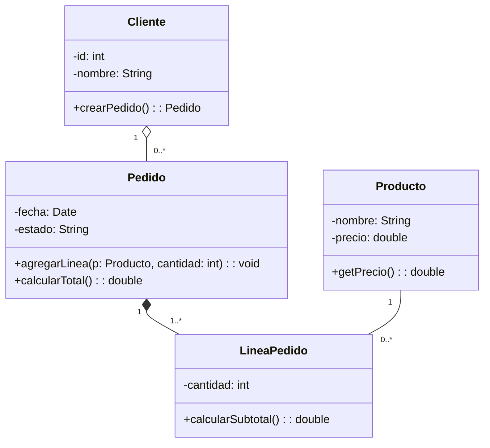

```mermaid
classDiagram

class Cliente {
    -id: int
    -nombre: String
    +crearPedido(): Pedido
}

class Pedido {
    -fecha: Date
    -estado: String
    +agregarLinea(p: Producto, cantidad: int): void
    +calcularTotal(): double
}

class LineaPedido {
    -cantidad: int
    +calcularSubtotal(): double
}

class Producto {
    -nombre: String
    -precio: double
    +getPrecio(): double
}

Cliente "1" o-- "0..*" Pedido
Pedido "1" *-- "1..*" LineaPedido
Producto "1" -- "0..*" LineaPedido
```
